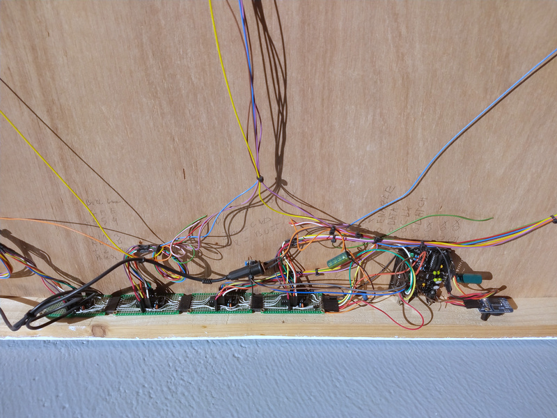

# Status

This project is in the idea stage.

Next step would be to test if the new schematic could work before ordering the first PCB.

# Why?

I made a huge LED clock with pieces of LED strip in 2013 using an [ATmega328 and DS3231 RTC](ATmega328%20version/). It has been running great and keeping time just fine. Lets break it by upgrading it.

This project will upgrade the ~~spagetti~~ old circuit to an internet connected LED strip clock neatly on a PCB. The brains will be a Wemos D1 mini and will use NTP to synchronize the time.

# Schematic

The [circuit](Kicad/LED%20Strip%20clock.pdf) recycles the same TPIC6B595 power shift registers and changes the ATmega328 for a ESP8266 and the DS3231 for a DS3231MZ. A 74HCT244 buffer translates between the 3.3V outputs of the ESP8266 and the 5V inputs of the shift register. The original circuit has a rotary encoder to set the light intensity and the current time. The new circuit will only use the rotary encoder to set the light intensity.

Render:

Real:

My [Kicad library](https://github.com/atoomnetmarc/ATOOMNETKICAD) is used in this project.

